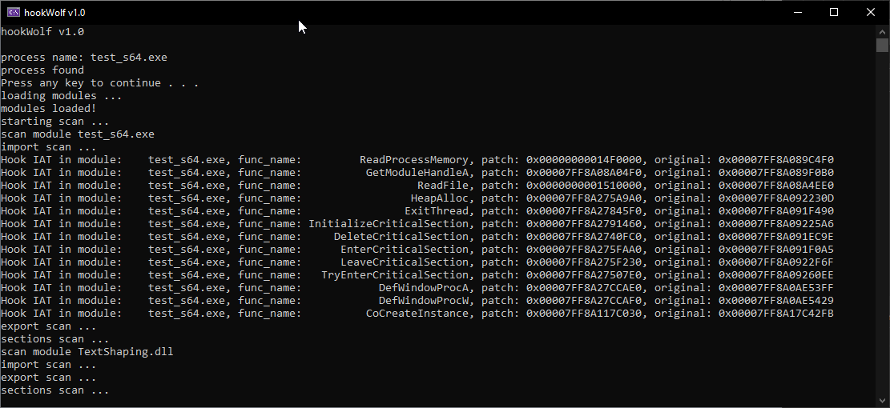
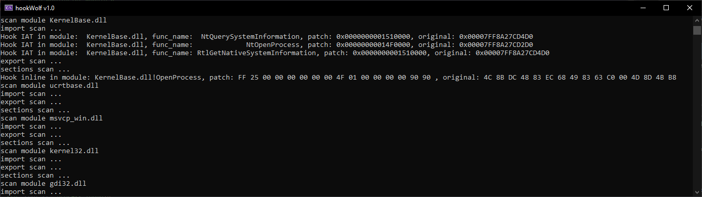

# hookWolf
 hook detector

## What is it ?
This tool was inspired by Hook Shark, but partially still.
The purpose is to detect hooks in a process made via IAT/EAT and INLINE, this will only work for modules without a packer (protectors like themida/VMP/Enigma and others).
The basis for this to work is to compare modules at runtime with modules stored at their source location. 

<h3 align="center">
  
  
</h3>

:warning: [NOTE] this project is still in the BETA phase, it may present problems when trying to analyze some modules, such as crash or fail in some cases. that's why I count on the contribution of anyone who can help improve this tool. 

## Compatibility
✔ Process on 64 bit architecture

:warning: 32-bit processes are not supported yet, and if you try you will have problems. 

## What was used to compile ?
- __Use Visual Studio__ - ([Download](https://visualstudio.microsoft.com/pt-br/))
- __Platform tools__  - Visual Studio 2019 (v142)
- __C++ SDK version used__ - 10.0 (latest installed version)

## How to use this ?
- First compile.
- Open and enter the name of the process you want to analyze and wait for the results. 

## Author
[SmoLL-iCe](https://github.com/SmoLL-iCe)

### License
